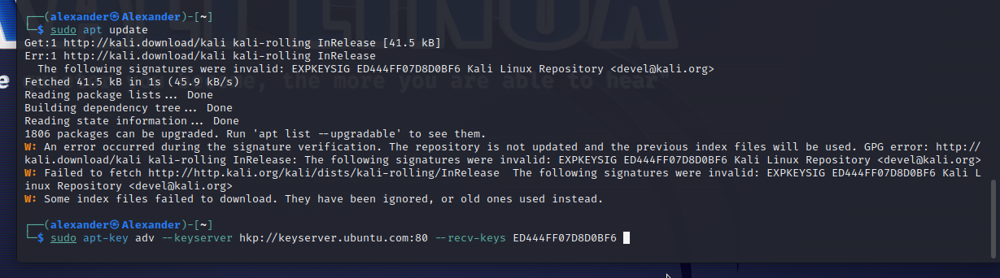
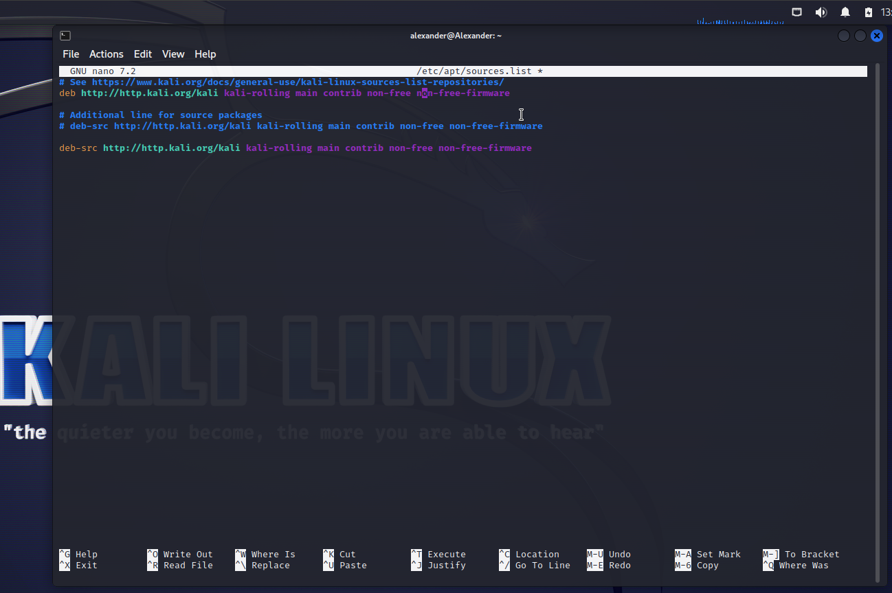
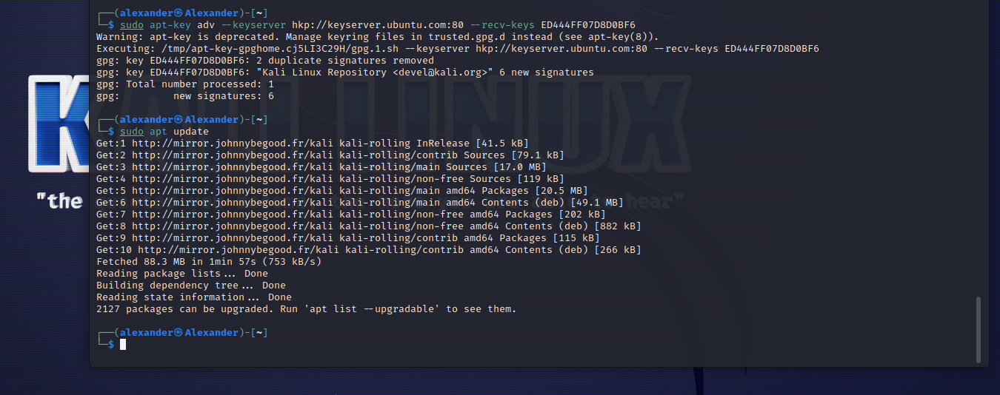

# 🚀 Kali Linux Update Guide

## 📝 Introduction
In this guide, I will walk you through the process of updating Kali Linux. I initially tried to update the system, but I missed an error related to an expired GPG key for the repositories. Once I realized the issue, I quickly fixed it, and the update was successful. Let's dive into the steps I took to get everything working! 🔧

## ⚙️ Step 1: Attempting to Update the System
I started by attempting to update my system with the following command:
sudo apt update

But I got an error I was ignoring.
## 🚨 Error Message:

## I even tried to edit the /dev/etc

## 🛠️ Step 2: Identifying and Fixing the Error
After realizing the error was related to the GPG key expiration, I took the following steps to resolve the issue.

I used the command to add the updated GPG key:

sudo apt-key adv --keyserver hkp://keyserver.ubuntu.com:80 --recv-keys ED444FF07D8D0BF6
To verify the new key, I ran:

sudo apt-key list
After the key was updated, I ran:

sudo apt update
This fixed the GPG key issue and allowed me to continue the system update.
## 🔄 Step 3: Successfully Updating the System
Once the key issue was fixed, I ran the following command to upgrade the system:

sudo apt upgrade

## The update process was completed successfully without further issues! 🎉

## 🎯 Conclusion
It’s essential to keep your Kali Linux system updated for security and stability. In my case, I initially missed the expired GPG key error, but after realizing the issue and updating the key, the system update went smoothly. Always pay attention to error messages during the update process to avoid complications. 🛡️
